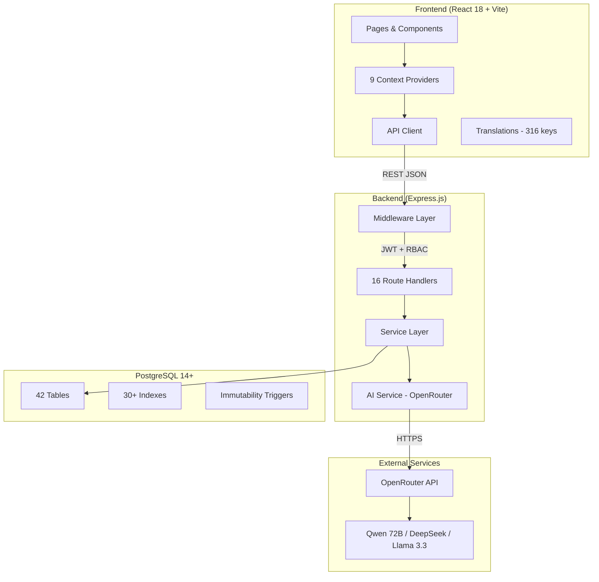
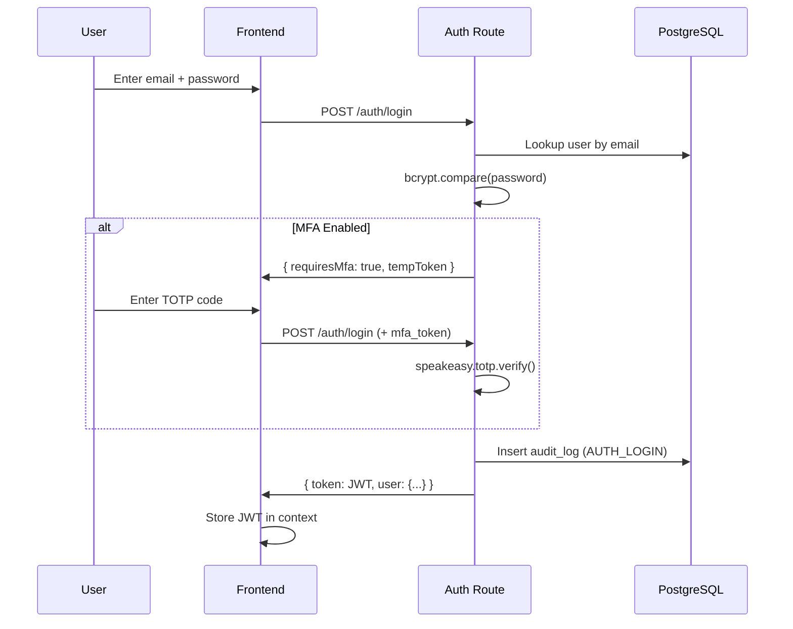
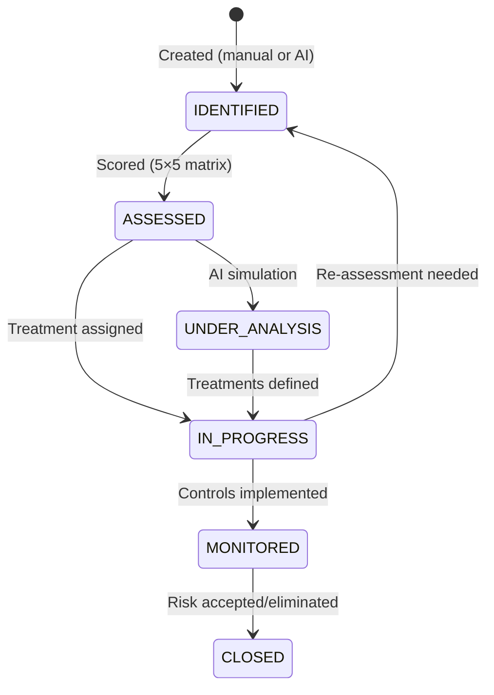

# Architecture Overview — Khalid Resilience GRC Platform

## High-Level Architecture



## Data Flow

### Authentication Flow



### Risk Lifecycle



## Security Model

### Middleware Stack (order matters)

1. **Helmet** — HTTP security headers
2. **CORS** — Origin whitelist
3. **Rate Limiter** — Auth: 15/15min, API: 200/min
4. **JSON Parser** — 10MB limit
5. **Input Sanitizer** — XSS + length enforcement
6. **JWT Authenticate** — Per-route
7. **RBAC Authorize** — Permission-based
8. **Audit Logger** — Immutable action logging

### RBAC Matrix

| Role | Risks | BIA | Sumood | Vendors | Incidents | Reports |
|------|-------|-----|--------|---------|-----------|---------|
| ADMIN | Full | Full | Full | Full | Full | Full |
| CRO | Full | Full | Full | Full | Full | Full |
| CISO | View | Approve | View | Full | Full | View |
| CEO | View | Approve | View | View | View | Full |
| DEPT_HEAD | Full | Full | Full | View | View | — |
| BC_COORD | View | Full | View | View | View | Full |
| ANALYST | Full | View | Full | Full | Full | — |
| VIEWER | View | View | View | — | — | — |

## AI Architecture

### Model Selection Strategy

| Feature | Model | Rationale |
|---------|-------|-----------|
| AI Agent Chat | Qwen 2.5 72B | Best Arabic reasoning |
| Risk Simulation | Qwen 2.5 72B | Complex scenario generation |
| Risk Generator | Qwen 2.5 72B | Department-specific personas |
| Sumood Compliance | Qwen 2.5 72B | Regulatory document analysis |
| Predictive Insights | DeepSeek Chat | Fast + cheap for analytics |
| Classification | Llama 3.1 8B (free) | Simple categorization |

### AI Service Stack

```
aiService (singleton)
├── chat() — main completion
├── generateJSON() — structured output + retry
├── analyzeDocument() — chunked doc analysis
├── stream() — real-time chat tokens
├── listAvailableModels()
│
├── CacheManager — PostgreSQL-backed TTL cache
├── TokenTracker — usage logging per request
├── RateLimiter — per-user, per-feature limits
└── Config — model selection, pricing
```

## Database Design Decisions

1. **UUID primary keys** — for users, BIA entities (distributed-safe)
2. **String IDs** — for risks (`RSK-XXXX`), incidents (`INC-YYYY-XXXX`) — human-readable
3. **JSONB** — for flexible fields (simulation data, recommendations)
4. **Immutability triggers** — `audit_log` and `risk_audit_trail` cannot be UPDATE/DELETE'd
5. **Composite indexes** — optimized for common filter patterns
6. **Cascade deletes** — on risk treatments, BIA sub-entities

## Key Design Decisions

| Decision | Choice | Rationale |
|----------|--------|-----------|
| AI Provider | OpenRouter (not direct APIs) | Single integration point, model flexibility, cost optimization |
| Auth | JWT (not sessions) | Stateless, works with multiple frontends |
| ORM | Knex.js (not Sequelize/Prisma) | Raw SQL when needed, migration system |
| State | React Context (not Redux) | 9 focused providers, simpler mental model |
| i18n | Custom translations.js | 316 keys, no heavy i18n library needed |
| CSS | Tailwind CSS | Rapid prototyping, RTL support |
